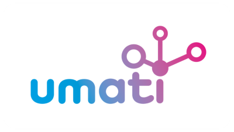

# umati - connecting the world of machinery

_**umati**_ (universal machine technology interface) is the global initiative for open communication interfaces for the machine building industries and their customers.

Machine builders, software producers, component suppliers, and users unite in a strong community to promote the use of open, standardized interfaces based on OPC UA companion specifications.
umati ensures their identical implementation, provides a platform to exchange experiences, creates visibility in the market, and provides hands-on demonstration of added values at <https://umati.app>.
